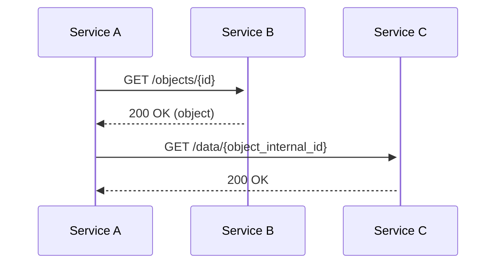

## References

- Other relevant documents
- Link to PRD

## Goals

Main KPIs of this feature

## High level design

- {{Flow chart, like this one}}

- DB changes
- UI components
- What is stored (e.g., in the state, local storage...)

## Third party integrations

- Logs
- Analytics

## Tests to be added

## Migrations

## Security implications

## Roll-out plan

<SwmMeta version="3.0.0" repo-id="Z2l0aHViJTNBJTNBQmFzaWMtRVJDXzIwJTNBJTNBZXJpY2NoZWxpbmk=" repo-name="Basic-ERC_20">Powered by [Swimm](https://app.swimm.io/)</SwmMeta>
